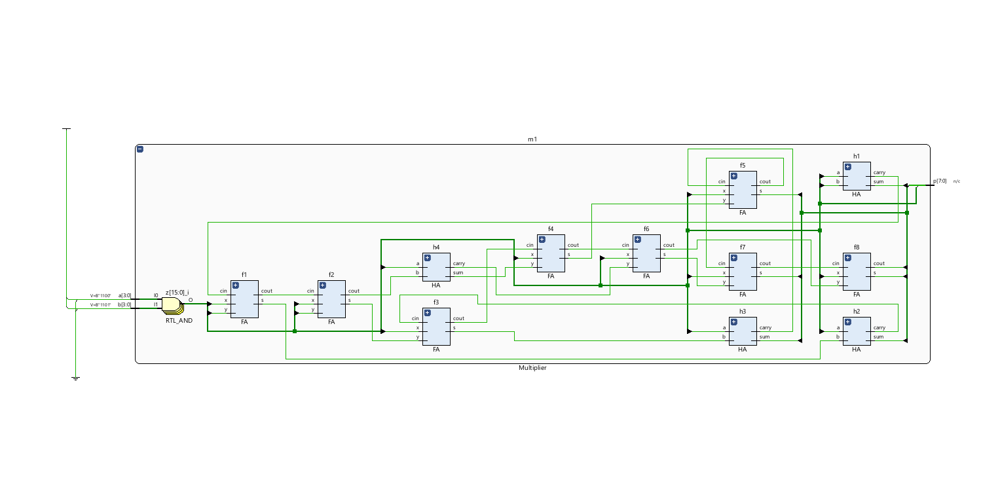
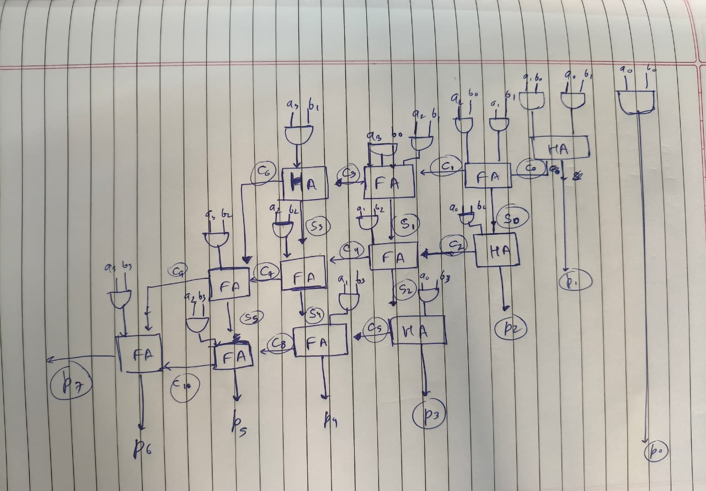
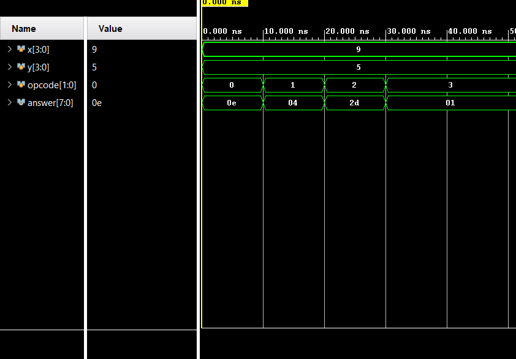

# 4-bit Arithmetic Logic Unit (ALU)

A structural and heirarchal implementation of 4-bit ALU in verilog,
    simulated and verified using AMD Xilinx Vivado

## Operations Included:

| Operation | OPcode | Implementation Details |
| :--- | :---: | :--- |
| **Addition** | `2'b00` | Implemented using a 4-bit Ripple Carry Adder |
| **Subtraction** | `2'b01` | Implemented using a subtractor with FA (performs $A + \sim B + 1$) |
| **Multiplication** | `2'b10` | Implemented by gate-level structure using HAs and FAs |
| **Division** | `2'b11` | Implemented by Behavioral description of Division Operator (`/`) |

## Verifications and Simulations:

* Multiplier:-
    Schematic:
        
    Block Diagram:
       
    Simulation:
    

* Full Model:-
    Schematic:
        
    Simulation:
    

## Specifications

* HDL - Verilog
* Simulation Tool - AMD Xilinx Vivado
* Architecture - 4 to 1 MUX via always@(*) and modules defined by instantiations
