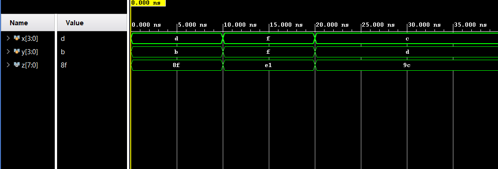
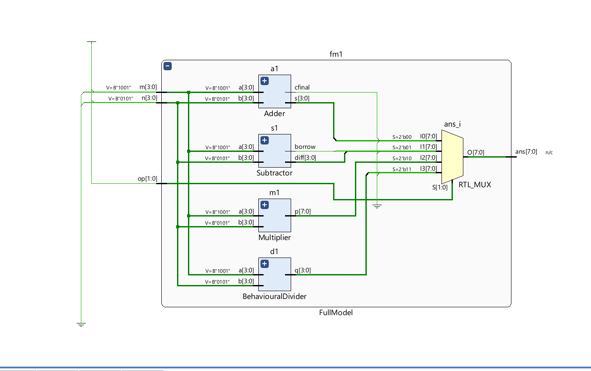

# 4-bit Arithmetic Logic Unit (ALU)

A structural and heirarchal implementation of 4-bit ALU in verilog,
    simulated and verified using AMD Xilinx Vivado

## Operations Included:
 * Addition (OPcode - 00) : Implemented using a 4-bit Ripple Carry Adder
 * Subtraction (OPcode - 01) : Implemented using a subtractor with FA (performs A + 2's complement(B) + 1)
 * Multiplication (OPcode - 10) : Implemented by gate-level behaviour and using HA's and FA's
 * Division (OPcode - 11) : Implemented by Behavourial description of Divisor Operator (" / ")

## Verifications and Simulations:

* Multiplier:-

    Schematic:
    
    
    Block Diagram:
    
    
    Simulation:
    

* Full Model:-

    Schematic:
    
    
    Simulation:
    

## Specifications

* HDL - Verilog
* Simulation Tool - AMD Xilinx Vivado
* Architecture - 4 to 1 MUX via always@(*) and modules defined by instantiations